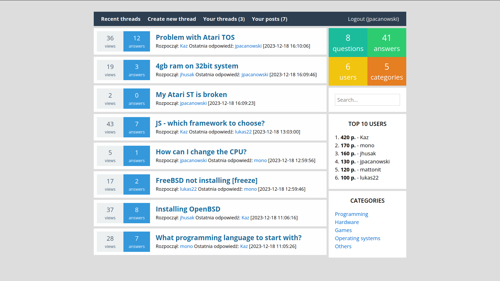

# Forum
A space where individuals from diverse backgrounds and interests can connect, share knowledge, and foster meaningful discussions. This collaborative forum aims to serve as a hub for open dialogue, peer support, and the exchange of ideas. Whether you're seeking expert advice, seeking camaraderie, or simply expanding your horizons, our forum provides a platform for enriching interactions.

### License
[MIT](https://mit-license.org/)
